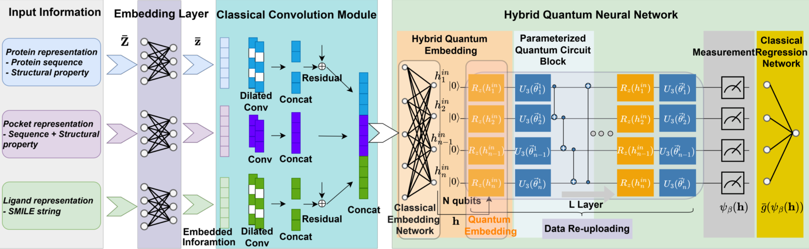

# Hybrid quantum neural network, Protein-ligand binding affinity, Quantum neural network, Universal approximation theory

#### Hybrid quantum neural network, Protein-ligand binding affinity, Quantum neural network, Universal approximation theory

Seon-Geun Jeong1, Kyeong-Hwan Moon2 and Won-Joo Hwang1,2,*

**Abstract** : The effectiveness of a drug in interacting with a specific protein target is linked to the drug-target affinity, which is primarily determined by the structures of both the chemical and the protein. Binding of a molecule to a protein may start a biological process. This includes the activation or inhibition of an enzyme’s activity as well as the interaction between a drug molecule and its intended protein target. The binding is quantified by how strong the chemical compound. This metric quantifies how firmly the ligand, which is another term for the chemical compound, connects to the protein. Traditionally, dissociation, half inhibition concentrations, and inhibition constants have been utilized to represent experimentally determined binding affinities. In drug discovery, a crucial selection criterion is the high binding affinity between a small molecule or short peptide and a receptor protein. Although the binding affinity could be measured directly through experimental methods, the time cost and financial expenses are extremely high due to insufficient known structures of protein-ligand complexes. Therefore, protein-ligand binding affinity prediction can serves significant advantage in the drug discovery. 

## Results

